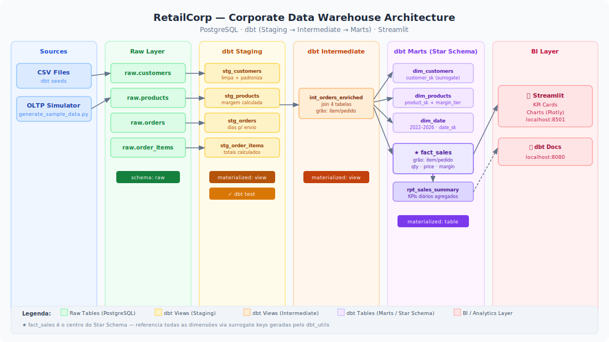

# Corporate Data Warehouse — Dimensional Modeling & dbt

https://walterbiel.github.io/RetailCorp-Corporate-Data-Warehouse/

> **RetailCorp Analytics Platform** — Data warehouse corporativo construído com modelagem dimensional (Star Schema) e dbt para transformações, sobre PostgreSQL.



---

## Sumário

- [Contexto de Negócio](#contexto-de-negócio)
- [Problema](#problema)
- [Objetivo](#objetivo)
- [Arquitetura da Solução](#arquitetura-da-solução)
- [Stack Utilizada](#stack-utilizada)
- [Estrutura de Pastas](#estrutura-de-pastas)
- [Modelo Dimensional](#modelo-dimensional)
- [Fluxo do Pipeline](#fluxo-do-pipeline)
- [Como Executar Localmente](#como-executar-localmente)
- [Como Rodar o dbt](#como-rodar-o-dbt)
- [Dashboard Streamlit](#dashboard-streamlit)
- [Testes](#testes)
- [Deploy em Nuvem](#deploy-em-nuvem)
- [Próximos Passos](#próximos-passos)

---

## Contexto de Negócio

A **RetailCorp** é uma empresa de varejo com operações em múltiplos estados, vendendo produtos em categorias como eletrônicos, vestuário e alimentos. Seu sistema transacional (OLTP) registra pedidos, clientes e produtos, mas os analistas de negócio não conseguem responder perguntas estratégicas com eficiência:

- Qual produto gerou mais receita nos últimos 3 meses?
- Quais clientes são mais valiosos por região?
- Como o desempenho de vendas varia por dia da semana?
- Qual categoria tem maior margem de contribuição?

---

## Problema

O banco OLTP é otimizado para escrita e está normalizado (3NF). Consultas analíticas complexas resultam em:
- Joins caros e lentos
- Dificuldade de manutenção das queries pelos analistas
- Sem histórico de dimensões (SCD)
- Sem camada de testes ou documentação de dados
- Impossibilidade de self-service para o time de BI

---

## Objetivo

Construir um **Data Warehouse corporativo** com:
1. **Modelagem Dimensional** (Star Schema) — tabelas de fato e dimensões
2. **Pipeline dbt** — transformações versionadas, testadas e documentadas
3. **Camadas de dados** — Raw → Staging → Intermediate → Marts
4. **Dashboard analítico** — Streamlit para visualização dos KPIs
5. **Infraestrutura reprodutível** — Docker + scripts de bootstrap

---

## Arquitetura da Solução

```
[Fontes de Dados]          [Raw Layer]          [dbt Transformations]          [Marts / DW]          [BI Layer]
CSV / OLTP Simulado   →   PostgreSQL (raw)  →   Staging → Intermediate   →   Star Schema      →   Streamlit Dashboard
                                               (dbt models)                  dim_* + fact_*
```

Veja `architecture/architecture.md` para descrição detalhada de cada bloco.

---

## Stack Utilizada

| Camada | Tecnologia | Justificativa |
|---|---|---|
| Banco de dados | PostgreSQL 15 | Robusto, gratuito, suporte nativo a SQL analítico |
| Transformações | dbt-core 1.7 | Padrão de mercado para pipelines SQL versionados |
| Orquestração local | Shell scripts | Simplicidade para ambiente de estudo |
| Dashboard | Streamlit | Rápido de implementar, ideal para portfólio |
| Containerização | Docker + Compose | Ambiente reprodutível sem instalação manual |
| Linguagem | Python 3.11 | Geração de dados e utilitários |
| Testes dbt | dbt test | Validação de qualidade dos dados no pipeline |

---

## Estrutura de Pastas

```
.
├── README.md
├── .gitignore
├── .env.example
├── requirements.txt
├── docker-compose.yml
├── Dockerfile
├── architecture/
│   ├── architecture.svg          # Diagrama visual da arquitetura
│   └── architecture.md           # Descrição de cada bloco
├── infra/
│   ├── docker/
│   │   └── postgres/
│   │       └── init.sql          # Inicialização do banco raw
│   └── sql/
│       ├── create_raw_tables.sql # DDL das tabelas raw
│       └── seed_data.sql         # Dados de exemplo para teste
├── dbt_project/
│   ├── dbt_project.yml           # Configuração principal do dbt
│   ├── profiles.yml              # Conexão com o banco
│   ├── packages.yml              # Pacotes dbt (dbt_utils)
│   ├── models/
│   │   ├── staging/              # Limpeza e padronização do raw
│   │   ├── intermediate/         # Enriquecimento e joins
│   │   └── marts/                # Dimensões, fatos e relatórios
│   ├── seeds/                    # CSVs de dados de exemplo
│   ├── macros/                   # Macros SQL reutilizáveis
│   └── tests/                    # Testes genéricos customizados
├── src/
│   ├── ingestion/
│   │   └── generate_sample_data.py  # Gerador de dados simulados
│   └── utils/
│       └── db_utils.py              # Utilitários de conexão
├── app/
│   └── streamlit_app.py          # Dashboard analítico
├── docs/
│   ├── business_context.md
│   ├── data_dictionary.md
│   ├── execution_guide.md
│   ├── teaching_guide.md
│   └── deployment_guide.md
├── scripts/
│   ├── bootstrap/
│   │   └── setup.sh              # Setup completo do ambiente
│   └── helpers/
│       └── run_pipeline.sh       # Execução completa do pipeline
└── tests/
    └── test_db_utils.py
```

---

## Modelo Dimensional

### Star Schema

```
                    ┌─────────────────┐
                    │   dim_date      │
                    │  (date_sk)      │
                    └────────┬────────┘
                             │
┌──────────────┐    ┌────────┴────────┐    ┌──────────────────┐
│ dim_customers│────│   fact_sales    │────│   dim_products   │
│ (customer_sk)│    │                 │    │   (product_sk)   │
└──────────────┘    │  order_item_sk  │    └──────────────────┘
                    │  customer_sk    │
                    │  product_sk     │
                    │  date_sk        │
                    │  quantity       │
                    │  unit_price     │
                    │  total_amount   │
                    │  discount       │
                    └─────────────────┘
```

### Tabelas

| Tabela | Tipo | Grão | Descrição |
|---|---|---|---|
| `dim_customers` | Dimensão | 1 linha por cliente | Atributos descritivos dos clientes |
| `dim_products` | Dimensão | 1 linha por produto | Atributos descritivos dos produtos |
| `dim_date` | Dimensão | 1 linha por dia | Calendário completo com atributos de data |
| `fact_sales` | Fato | 1 linha por item de pedido | Medidas de venda (qty, preço, total) |
| `rpt_sales_summary` | Relatório | Agregado por data/produto | KPI diário de vendas por produto |

---

## Fluxo do Pipeline

```
1. [Bootstrap]    docker-compose up -d  →  PostgreSQL rodando
2. [Seed Data]    python generate_sample_data.py  →  tabelas raw populadas
3. [dbt deps]     dbt deps  →  pacotes instalados
4. [dbt seed]     dbt seed  →  CSVs carregados no banco
5. [dbt run]      dbt run  →  modelos executados (staging → intermediate → marts)
6. [dbt test]     dbt test  →  validações de qualidade
7. [dbt docs]     dbt docs generate && dbt docs serve  →  documentação interativa
8. [Dashboard]    streamlit run app/streamlit_app.py  →  visualização dos KPIs
```

---

## Como Executar Localmente

### Pré-requisitos

- Docker e Docker Compose instalados
- Python 3.11+
- pip ou pipenv

### 1. Clonar e configurar

```bash
git clone <repo-url>
cd corporate-data-warehouse-dbt
cp .env.example .env
```

### 2. Subir o banco de dados

```bash
docker-compose up -d postgres
```

### 3. Instalar dependências Python

```bash
pip install -r requirements.txt
```

### 4. Gerar dados de exemplo

```bash
python src/ingestion/generate_sample_data.py
```

### 5. Executar o pipeline dbt completo

```bash
cd dbt_project
dbt deps
dbt seed
dbt run
dbt test
```

### 6. Gerar documentação do dbt

```bash
dbt docs generate
dbt docs serve
# Abrir http://localhost:8080
```

### 7. Rodar o dashboard

```bash
streamlit run app/streamlit_app.py
# Abrir http://localhost:8501
```

### Ou use o script automatizado

```bash
chmod +x scripts/bootstrap/setup.sh
./scripts/bootstrap/setup.sh
```

---

## Como Rodar o dbt

```bash
cd dbt_project

# Instalar pacotes
dbt deps

# Carregar seeds (CSVs)
dbt seed

# Rodar todos os modelos
dbt run

# Rodar apenas uma camada
dbt run --select staging
dbt run --select intermediate
dbt run --select marts

# Rodar modelo específico
dbt run --select fact_sales

# Rodar com upstream/downstream
dbt run --select +fact_sales        # fact_sales e suas dependências
dbt run --select fact_sales+        # fact_sales e modelos que dependem dela

# Rodar testes
dbt test

# Gerar e servir docs
dbt docs generate
dbt docs serve
```

---

## Dashboard Streamlit

O dashboard exibe os seguintes KPIs:

- **Receita Total** — total acumulado de vendas
- **Número de Pedidos** — volume de transações
- **Ticket Médio** — receita média por pedido
- **Top 10 Produtos** — por receita
- **Vendas por Categoria** — gráfico de barras
- **Evolução de Receita** — série temporal diária
- **Top Clientes** — por receita acumulada

---

## Testes

```bash
# Testes dbt (qualidade dos dados)
cd dbt_project && dbt test

# Testes Python (utilitários)
pytest tests/
```

---

## Deploy em Nuvem

Veja `docs/deployment_guide.md` para instruções completas de deploy em:
- **Render** (PostgreSQL + Streamlit — gratuito para portfólio)
- **Railway** (PostgreSQL + deploy automático via GitHub)
- **Azure** (Azure Database for PostgreSQL + Azure App Service)

---

## Próximos Passos

- [ ] Implementar SCD Tipo 2 nas dimensões (histórico de mudanças)
- [ ] Adicionar orquestração com Apache Airflow
- [ ] Integrar com fonte de dados real via dlt ou Airbyte
- [ ] Implementar camada de acesso via dbt Exposures
- [ ] Adicionar métricas dbt (dbt Metrics Layer)
- [ ] Conectar Metabase ou Power BI ao schema marts
- [ ] Adicionar particionamento por data na fact_sales
- [ ] Implementar alertas de qualidade de dados com Elementary

---

## Autor

Projeto desenvolvido como portfólio de Engenharia de Dados Analíticos.
Tecnologias: PostgreSQL · dbt · Python · Streamlit · Docker
